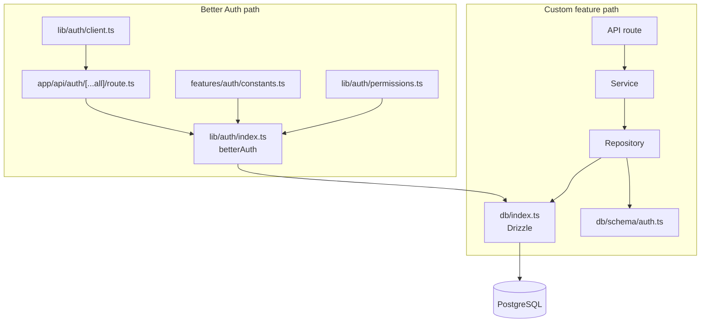
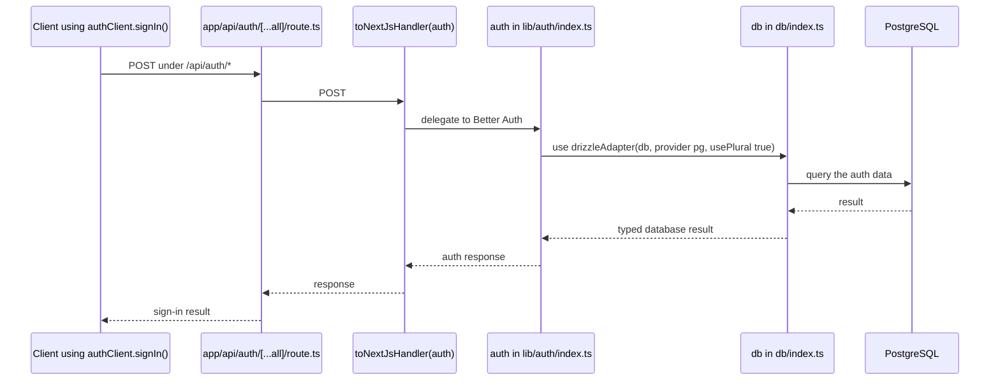

# Architecture

## Runtime

This template combines a Next.js app, PostgreSQL, and Better Auth:

- `app/` contains the app router and the catch-all auth route.
- `db/index.ts` creates the Drizzle client from `DATABASE_URL`.
- `db/schema/auth.ts` defines the auth tables and the PostgreSQL `role` enum.
- `lib/auth/index.ts` configures the server-side `betterAuth` instance and Drizzle adapter.
- `lib/auth/client.ts` exposes the browser auth client and its operations.

## One-way feature dependencies

Custom feature code follows the rule documented in the README: **API route → service → repository**.

| Layer         | Responsibility                                                         | Boundary                                                                        |
| ------------- | ---------------------------------------------------------------------- | ------------------------------------------------------------------------------- |
| API route     | Parse and validate HTTP input, call a service, shape a response.       | May not query `db`; custom handlers use `withErrorHandling`.                    |
| Service       | Own business rules, permissions, invariants, and `AppError` instances. | Framework-agnostic; must not use `NextRequest`, `NextResponse`, or `headers()`. |
| Repository    | Read and write Drizzle rows and return plain data.                     | The only custom-feature layer that may import `db` and query tables.            |
| `db/types.ts` | Expose generated row and insert types.                                 | Generated by `pnpm db:types`; it does not contain business rules.               |

`withErrorHandling` converts an `AppError` to `{ message }` with its status, and turns other errors into a logged 500 response. Routes should let the wrapper handle errors instead of adding their own `try/catch`.

## Current auth example

The repository does **not** currently contain `features/auth/repositories/`, `features/auth/services/`, or custom auth routes. The existing auth integration shows the surrounding boundaries instead:

- `features/auth/constants.ts` supplies the seven-day expiry and one-day update values to `lib/auth/index.ts`.
- `lib/auth/permissions.ts` defines the `USER`, `ADMIN`, and `DEVELOPER` access-control roles.
- `lib/auth/index.ts` passes those roles and the `user.role` field to Better Auth.
- `app/api/auth/[...all]/route.ts` delegates `GET` and `POST` requests to that configured instance through `toNextJsHandler(auth)`.

The custom-feature path and the Better Auth integration are therefore separate; the auth route is not an example of a local service/repository implementation.



<!-- TODO: add a concrete custom-feature repository/service example when one exists. -->

## Request flow

`lib/auth/client.ts` exports `signIn` from `authClient`. The local route file does not define a named sign-in function: `app/api/auth/[...all]/route.ts` exports the `GET` and `POST` handlers returned by `toNextJsHandler(auth)`, and the configured Better Auth instance handles the request.



There is no local auth service or repository in this path: `features/auth/` currently contains constants and tests only. The auth integration is delegated to Better Auth and its Drizzle adapter.

For a server-side session read, `app/page.tsx` calls `getServerSession()` from `lib/auth/session.ts`; that helper caches `auth.api.getSession` and supplies the request `headers()`.

<!-- TODO: document the concrete Better Auth subpaths and email-provider setup when they are explicitly configured in the application. -->

## Data model

The schema source is `db/schema/auth.ts`, re-exported by `db/schema/index.ts`. The current migration is `drizzle/0000_init.sql`; `pnpm db:types` regenerates the inferred types in `db/types.ts`.

```mermaid
erDiagram
  users {
    text id PK
    text name
    text email UK
    text username UK
    role role
    boolean email_verified
    text image
    timestamp created_at
    timestamp updated_at
  }

  sessions {
    text id PK
    timestamp expires_at
    text token UK
    timestamp created_at
    timestamp updated_at
    text ip_address
    text user_agent
    text user_id FK
  }

  account {
    text id PK
    text account_id
    text provider_id
    text user_id FK
    text access_token
    text refresh_token
    text id_token
    timestamp access_token_expires_at
    timestamp refresh_token_expires_at
    text scope
    text password
    timestamp created_at
    timestamp updated_at
  }

  verifications {
    text id PK
    text identifier
    text value
    timestamp expires_at
    timestamp created_at
    timestamp updated_at
  }

  role_enum {
    USER "enum value"
    ADMIN "enum value"
    DEVELOPER "enum value"
  }

  users ||--o{ sessions : "user_id -> id"
  users ||--o{ account : "user_id -> id"
  users }o--|| role_enum : "role"
```

`role_enum` is a diagram-only representation of the PostgreSQL enum named `role`; it is not a table. The Drizzle export is `userRoleEnum`, and its values are `USER`, `ADMIN`, and `DEVELOPER`.

- `users.email` and `users.username` are unique; `role` defaults to `USER`, and `email_verified` defaults to `false`.
- `sessions.user_id` and `account.user_id` reference `users.id` with `ON DELETE CASCADE`; both have a `userId` index.
- `verifications.identifier` has an index and has no foreign key in the schema.
- `db/types.ts` exports `User`, `Session`, `Account`, `Verification` and their `New*` insert types.
